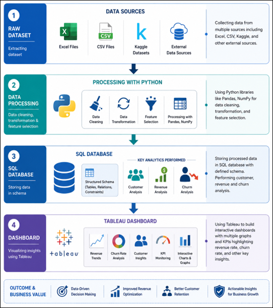

# 📉 Customer Retention & Churn Analytics
### End-to-End Telecom Churn Analysis | Python · PostgreSQL · SQLAlchemy · Tableau

---

## 📌 Project Overview

A full-stack analytics solution investigating customer churn for a subscription-based telecom company. This project covers every stage of the data pipeline — from raw data ingestion and cleaning through SQL modelling, database integration, and interactive dashboard delivery.

The goal was to move beyond surface-level churn metrics and answer the questions that actually drive business decisions: **who is leaving, why, and what can be done about it?**

---

## 📊 Key Results

| Metric | Value |
|---|---|
| Total Customers Analysed | **7,032** |
| Overall Churn Rate | **26.58%** |
| Monthly Revenue | **$455K** |
| Monthly Revenue Lost to Churn | **$139K** |

### Critical Findings

- Month-to-month contract holders churn at **42.71%** — nearly **15×** the rate of two-year contract customers (2.85%)
- New customers (0–12 months tenure) exhibit the highest churn rate at **47.68%**, pointing to a critical early-lifecycle vulnerability
- Electronic check users churn at **45.29%** — almost triple the rate of automatic payment users
- Fiber optic subscribers churn at **41.89%** despite being the premium service tier, suggesting a pricing or service-quality concern
- The Loyal customer cohort (49–72 months) accounts for a disproportionate share of total revenue at a churn rate of just **9.51%**

---

## 🗂️ Dataset

**Source:** [IBM Telco Customer Churn — Kaggle](https://www.kaggle.com/datasets/blastchar/telco-customer-churn)

- 7,043 raw records → **7,032 after cleaning** (11 records dropped due to missing `TotalCharges`)
- 21 original features + **2 engineered features** = 23 total columns
- Target variable: `Churn` (Yes / No)

### Engineered Features

| Feature | Description |
|---|---|
| `TenureGroup` | Binned tenure into New (0–12m), Growing (13–24m), Established (25–48m), Loyal (49–72m) |
| `TotalSubsCharge` | `MonthlyCharges × tenure` — a proxy for observed customer lifetime value |

---

## 🛠️ Tech Stack

| Layer | Tools |
|---|---|
| Data Wrangling & EDA | Python · Pandas · NumPy · Matplotlib · Seaborn |
| Statistical Testing | SciPy (`chi2_contingency`, `ttest_ind`) |
| Database | PostgreSQL (`telco_db`) |
| DB Connectivity | SQLAlchemy · psycopg2 |
| Visualisation | Tableau |
| Version Control | Git · GitHub |

---

## 🔄 Project Pipeline



---

## 🗃️ SQL Views

Six analytical views were built on top of the `telco_churn` table to serve the Tableau dashboard with pre-aggregated, analysis-ready result sets.

| View | Purpose |
|---|---|
| `churn_summary` | Overall KPIs: customer count, churn rate, revenue, revenue lost |
| `churn_by_contract` | Churn rate grouped by contract type |
| `churn_by_internet` | Churn rate grouped by internet service tier |
| `churn_by_payment` | Churn rate ranked by payment method |
| `revenue_by_contract` | Total revenue aggregated by contract type |
| `customer_segments` | Cohort metrics by TenureGroup (count, avg charge, revenue) |

---

## 📈 Statistical Validation

All key relationships were formally tested before being elevated to business recommendations.

| Variable | Test | p-value | Finding |
|---|---|---|---|
| Contract Type | Chi-Square | < 0.001 | Significant predictor of churn |
| Payment Method | Chi-Square | < 0.001 | Significant predictor of churn |
| Tenure | Independent T-Test | < 0.001 | Churned customers have shorter tenure |
| Monthly Charges | Independent T-Test | < 0.001 | Churned customers pay higher monthly rates |

---

## 💡 Business Recommendations

1. **Contract Upgrades** — Offer month-to-month customers a discounted rate to commit to annual or two-year contracts within their first 90 days
2. **Onboarding Programme** — Implement automated check-ins at Day 7, 30, and 90 to reduce early-lifecycle churn
3. **Payment Method Migration** — Incentivise a switch to automatic payments via a monthly bill credit; use electronic check status as a churn risk flag
4. **Fibre Optic Investigation** — Run NPS surveys among fibre customers and benchmark pricing against competitors; consider value-add bundling to reduce churn
5. **Loyalty Rewards** — Introduce formal recognition and perks for customers passing the 4-year mark to protect the highest-revenue cohort

---

## ⚠️ Limitations

- **Cross-sectional data only** — a single snapshot; no time-series cohort analysis was possible
- **No geographic data** — regional churn patterns could not be examined
- **No churn reason captured** — the dataset records *that* customers churned, not *why*

---

## 🔭 Future Scope

- **Predictive modelling** — binary churn classifier (Logistic Regression / XGBoost) evaluated on precision, recall, and AUC-ROC
- **CLV integration** — estimate customer lifetime value to prioritise retention spend on highest-value at-risk customers
- **Cohort retention heatmap** — month-over-month retention matrix if subscription start dates become available
- **Live monitoring** — connect SQL views to Tableau Server or Power BI for real-time churn alerting
- **A/B testing framework** — controlled experiments to measure retention lift from the interventions in Section 7

---

## 📁 Repository Structure

```
├── WA_Fn-UseC_-Telco-Customer-Churn.csv        # Original Kaggle dataset
├── Updated_Churn_Analysis_Dataset.csv          # Cleaned & feature-engineered dataset
├── Telco_EDA.ipynb                             # Full EDA, cleaning, testing
├── Telco_PostgreSQL.py                         # Full EDA, cleaning, testing
├── Churn Analysis.twbx                         # Tableau workbook (packaged)
├── Customer_Churn_Analysis_Report.pdf
├── pipeline_diagram.png
└── README.md
```

---

## 🚀 Getting Started

### Prerequisites

```bash
pip install pandas numpy matplotlib seaborn scipy sqlalchemy psycopg2-binary
```

### PostgreSQL Setup

1. Create a database named `telco_db` on your local PostgreSQL instance
2. Update the connection string in the notebook if your credentials differ:
   ```python
   engine = create_engine("postgresql+psycopg2://username:password@{host}:{port}/telco_db")
   ```
3. Run the notebook — it will create the `telco_churn` table and all views automatically

### Tableau

Open `churn_dashboard.twbx` in Tableau Desktop. Update the PostgreSQL data source connection to match your local credentials if prompted.

---

## 📄 Dataset Citation

IBM Telco Customer Churn Dataset — BlastChar via Kaggle  
https://www.kaggle.com/datasets/blastchar/telco-customer-churn

---

*Analysis conducted June 2026*
